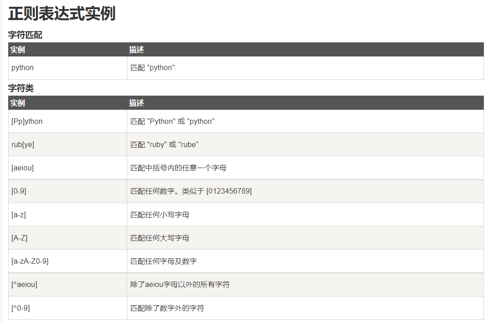
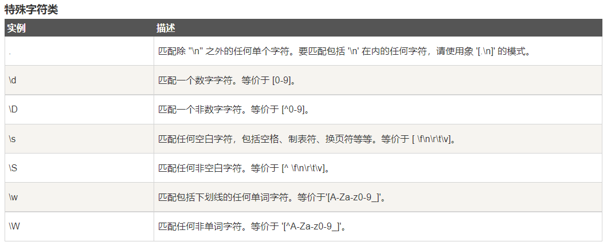
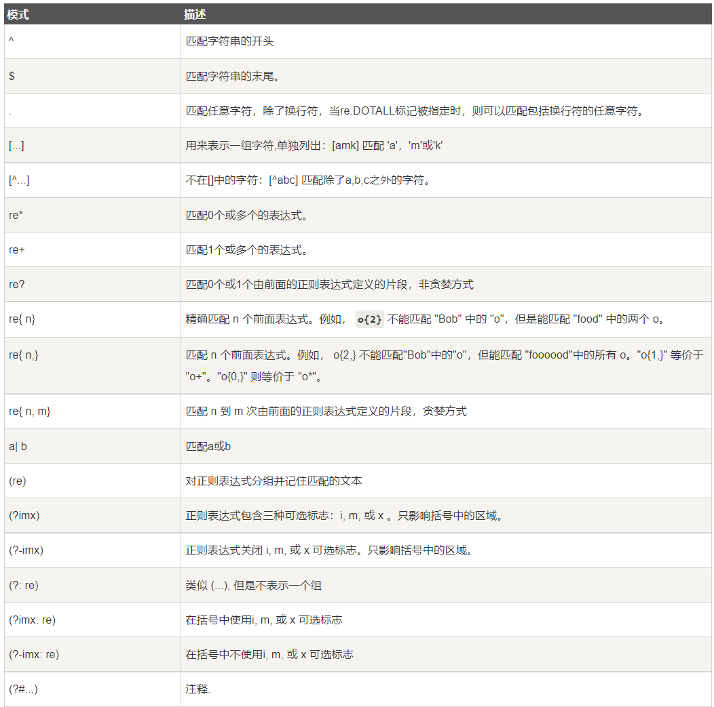
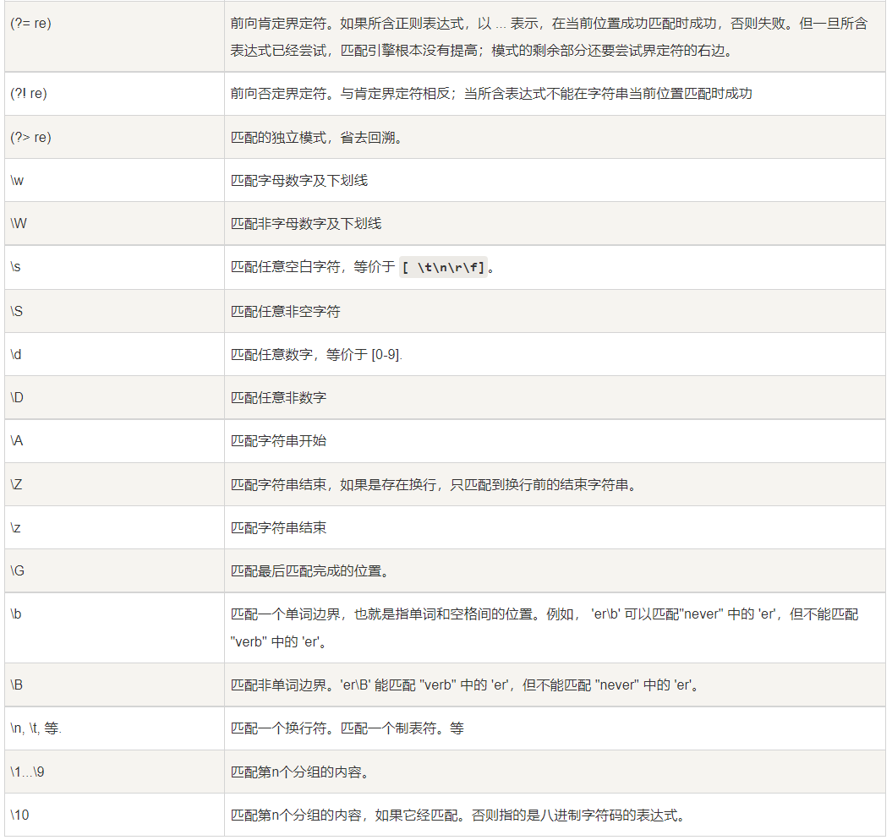

# Python 正则表达式
## 1、Re 模块
| 参数 | 描述|
|---|------------------------------------------------------------------|
| re.match函数| re.match 尝试从字符串的起始位置匹配一个模式，如果不是起始位置匹配成功的话，match() 就返回 none。|
| re.search | re.search 扫描整个字符串并返回第一个成功的匹配|
| re.match与re.search的区别 | re.match只匹配字符串的开始，如果字符串开始不符合正则表达式，则匹配失败，函数返回None；而re.search匹配整个字符串，直到找到一个匹配 |
| re.sub| re 模块提供了re.sub用于替换字符串中的匹配项 |
| re.compile | compile 函数用于编译正则表达式，生成一个正则表达式（ Pattern ）对象，供 match() 和 search() 这两个函数使用 |
| re.findall | 在字符串中找到正则表达式所匹配的所有子串，并返回一个列表，如果有多个匹配模式，则返回元组列表，如果没有找到匹配的，则返回空列表. 注意： match 和 search 是匹配一次 findall 匹配所有。|
| re.finditer | 和 findall 类似，在字符串中找到正则表达式所匹配的所有子串，并把它们作为一个迭代器返回。 |
| re.split | split 方法按照能够匹配的子串将字符串分割后返回列表 |

# 2、正则表达式模式

